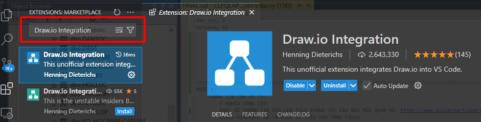
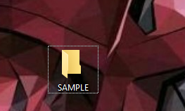
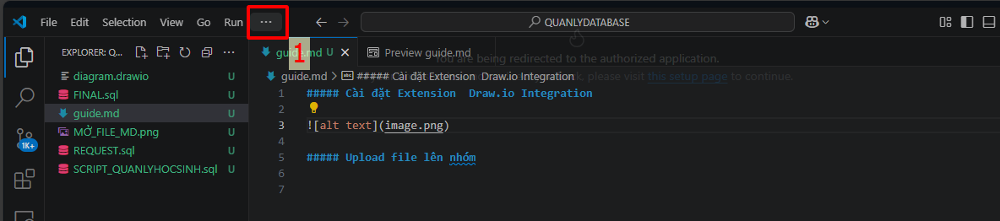
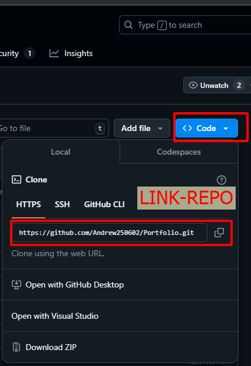

##### Cài đặt Extension  Draw.io Integration

##### Upload file lên nhóm 

#### TẠO WORK
    

#### MỞ TERMINAL

    # terminal -> new terminal

#### STEP 1:
    --- THIẾT LẬP LIÊN KẾT VỚI REPO 
    #  git remote set-url origin LINK-REPO 

#### STEP 2:
    --- TẠO CHƯA KHỞI TẠO GIT THÌ LÀM LỆNH NÀY KHÔNG THÌ BỎ QUA
    #  git remote set-url origin LINK-REPO 

