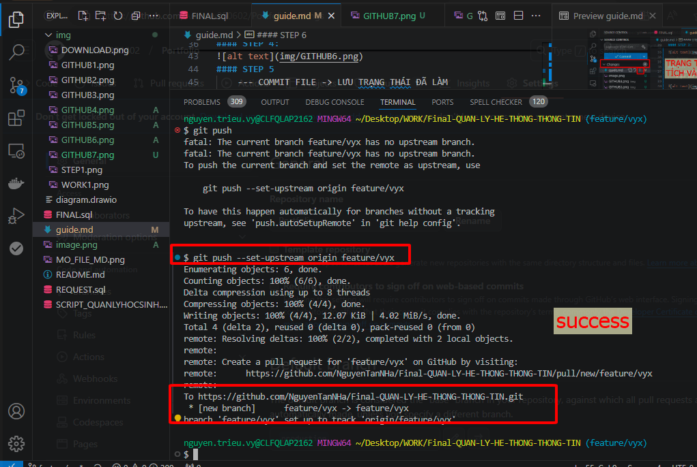

##### Cài đặt Extension  Draw.io Integration

##### Upload file lên nhóm 

#### TẠO WORK
    

#### MỞ TERMINAL

    # terminal -> new terminal

#### STEP 1:
    --- THIẾT LẬP LIÊN KẾT VỚI REPO 
    #  git remote set-url origin LINK-REPO 

#### STEP 2:
    --- TẠO CHƯA KHỞI TẠO GIT THÌ LÀM LỆNH NÀY KHÔNG THÌ BỎ QUA
    #  git remote add origin LINK-REPO 

#### STEP 3: 
    --- CHUYỂN BRANCH LÀM VIỆC
    # git checkout -b BranchName

#### STEP 4: 
    --- KHI XONG VIỆC THÌ UPLOAD FILE BẰNG CÁCH
    # git add TEN_FILE.ĐUOI_FILE

    --- HOẶC ADD BẰNG GIT CONTROL 
    

#### STEP 5 
    --- COMMIT FILE -> LƯU TRẠNG THÁI ĐÃ LÀM 
    # git commit -m " comment bất kỳ "

    -- HOẶC COMMIT BẰNG GIT CONTROL

#### STEP 6
    # đẩy lên git 
        git push --set-upstream origin branchName

    -- HOẶC ĐẨY BẰNG GIT CONTROL 